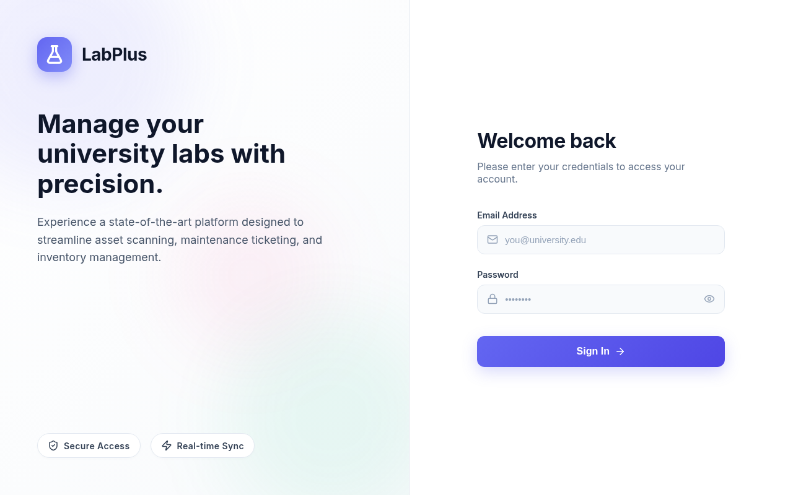
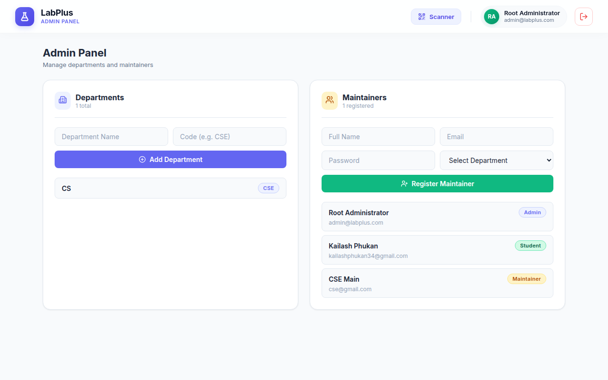

# LabPlus - University Lab Management System

LabPlus is a comprehensive platform designed to manage university labs with precision. It provides a state-of-the-art interface to streamline asset scanning, maintenance ticketing, and inventory management for laboratories.

## 🚀 Features
- **Asset Management**: Seamlessly manage, categorize, and track lab equipment.
- **Maintenance Ticketing**: Quickly raise and track maintenance tickets for lab assets.
- **Role-Based Access**: Specialized dashboards for Admins, Maintainers, and Students.
- **Real-Time Synchronisation**: Provides an interactive and seamless user experience across devices.

## 📸 Screenshots

### Login Page


### Dashboard Page


## 🛠️ Project Setup

Follow these steps to set up the LabPlus application locally.

### Prerequisites
- [Node.js](https://nodejs.org/en/) (v14 or above)
- [MySQL](https://www.mysql.com/)

### 1. Database Configuration
Ensure your MySQL server is running. No need to manually create the database; the initialization script will handle it.

### 2. Backend Setup
1. Navigate to the backend directory:
   ```bash
   cd backend
   ```
2. Install dependencies:
   ```bash
   npm install
   ```
3. Create a `.env` file in the `backend` directory based on the following template:
   ```env
   # Database
   DB_HOST=localhost
   DB_USER=root
   DB_PASSWORD=your_mysql_password
   DB_NAME=LabPlus

   # JWT
   JWT_SECRET=your_super_secret_jwt_key

   # Email
   EMAIL_USER=your_email_username
   EMAIL_PASS=your_password
   
   PORT=10500
   ```
4. Initialize the database (this will create the DB, tables, and seed initial data including the root admin user):
   ```bash
   node db_initialize.js
   ```
5. Start the backend server:
   ```bash
   npm run dev
   ```

### 3. Frontend Setup
1. Open a new terminal and navigate to the frontend directory:
   ```bash
   cd frontend
   ```
2. Install dependencies:
   ```bash
   npm install
   ```
3. Create a `.env` file in the `frontend` directory:
   ```env
   API_BASE_URL=http://localhost:10500
   ```
4. Start the frontend development server:
   ```bash
   npm run dev
   ```

### 4. Access the Application
- Open your browser and navigate to: `http://localhost:5173/`
- Use the initial root admin credentials seeded during initialization to login:
  - **Email**: `admin@labplus.com`
  - **Password**: `admin123`

## 💻 Tech Stack
- **Frontend**: React.js, Vite, Tailwind CSS, Lucide React
- **Backend**: Node.js, Express.js, MySQL2, JSON Web Tokens (JWT)

## 📄 License
This project is licensed under the ISC License.
